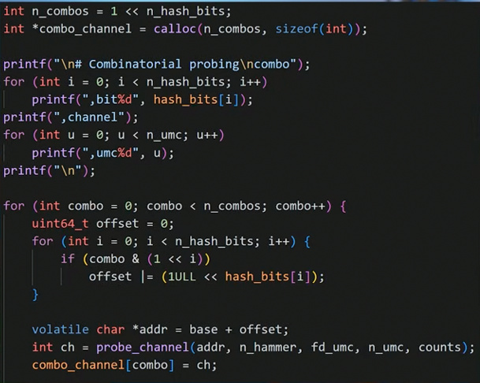

[](https://www.apache.org/licenses/LICENSE-2.0)
[](https://github.com/LaurieWired/tailslayer/stargazers)
[](https://github.com/LaurieWired/tailslayer/network/members)
[](https://github.com/LaurieWired/tailslayer/graphs/contributors)
[](https://twitter.com/lauriewired)

# Personal (inonitz) Note Before The actual README.md

## A **WORKING Win32 port of Lauries' tailslayer library**

If you only care about running this [Here's what you need to consider](#porting-notes-3---tldr)

### Porting Notes 1 - Memory allocation

One of the core issues preventing this library from working properly is the lack of memory reservation/Huge Page Allocation Mechanisms available on windows  
In linux you can just reserve a Huge (1GiB)/Large (2MiB) Page and call it a day  
  *Ofcourse, you still need to `mmap` it with `HUGE_TLB` and maybe a little bit of `sudo` action but you get the idea!*  

On Windows, this becomes much more difficult, since there is no easy & viable way to allocate physically Huge (1GiB!) Pages.  
Sure there is [VirtualAlloc2](https://learn.microsoft.com/en-us/windows/win32/api/memoryapi/nf-memoryapi-virtualalloc2), but God help you if it even works on your system *(It sure as hell didn't work on mine!)*  
Anyway, [VirtualAlloc](https://learn.microsoft.com/en-us/windows/win32/api/memoryapi/nf-memoryapi-virtualalloc) with `MEM_LARGE_PAGES` Does work, *But!*  
   It requires searching the virtual-memory region manually, looking for the *Biggest physically-contiguous memory* region,  
   verfiying that it actually does satisfy the original allocation request.  

Needless to say, this is *dodgy as hell* and doesn't always work.  
For instance, after ~8 Hours of Intense usage of my machines' RAM I cannot get the benchmarking executable to run at all (Doesn't matter which benchmark type, `dual_stress` or `dual_quiet`)  

### Porting Notes 2 - Channel Verification Code

Another Issue that creeped up during the port is probably an error / intentional on LaurieWireds' Side, but the code to verify the DRAM channel index is limited only to 2 channels:  
```cpp
__force_inline inline int compute_channel(uint64_t physAddr, int channel_bit) {
    return (physAddr >> channel_bit) & 1; /* This can be 0/1, i.e channel 0/1 */
}
```  

I don't personally know why the code was kept like this, even though Laurie showed the code for this explicitly in her video:  

  

Furthermore, there is an extra-paranoid check in the `setup_replica_page` function to make sure the data is kept on different DRAM Channels,  
which is Good! but when you have more than 2 channels you will ***Never*** pass this point:  

```cpp
static bool setup_replica_page(const AppConfig& config, MemorySetup& mem) {
    ...
    /* benchmark/source/main.cpp Line 129 */
    // Sanity check to make sure the replicas did end up on different channels
    for (int i = 0; i < config.n_channels; ++i) {
        for (int j = i + 1; j < config.n_channels; ++j) {
            if (channels[i] == channels[j]) {
                fprintf(stderr, "ERROR: Replicas %d and %d on same channel (%d)!\n", 
                    i, j, 
                    channels[i]
                );
                mem.m_replicaPage = nullptr;
                return false;
            }
        }
    }
    return true;
}
```  

For now, this piece of code has been blanked out, you'll have to trust the python benchmarks to see if your data at bit *X*, i.e Memory-Offset *(1 << X)* really-did end up on different channels. (The benchmark plots are also a personal nitpick of mine, but I got it to work so it is fine)

### Porting Notes 3 - TLDR

If you want this code to work reliably (On Windows) -  

* Run it on system-boot, or atleast close enough to system boot
* Expect it to take a lot of memory (Atleast on windows)
* Run it as administrator *(!)*

<br></br>


# Tailslayer

Tailslayer is a C++ library that reduces tail latency in RAM reads caused by DRAM refresh stalls. 

It replicates data across multiple, independent DRAM channels with uncorrelated refresh schedules, using (undocumented!) channel scrambling offsets that works on AMD, Intel, and Graviton. Once the request comes in, Tailslayer issues hedged reads across all replicas, allowing the work to be performed on whichever result responds first.


## Usage

The library code is available in [hedged_reader.cpp](https://github.com/LaurieWired/tailslayer/blob/main/include/tailslayer/hedged_reader.hpp) and the example using the library can be found in [tailslayer_example.cpp](https://github.com/LaurieWired/tailslayer/blob/main/tailslayer_example.cpp). To use it, copy `include/tailslayer` into your project and `#include <tailslayer/hedged_reader.hpp>`. The library currently works with two channels (updates to come!), but full N-way usage is available in the [benchmark](https://github.com/LaurieWired/tailslayer/tree/main/discovery/benchmark).

You provide the value type and two functions as template parameters:

1. **Signal function**: Add the loop that waits for the external signal. This determines when to read. Return the desired index to read, and the read immediately fires.
2. **Final work function**: This receives the value immediately after it is read. Add the desired value processing code here.

```cpp
#include <tailslayer/hedged_reader.hpp>

[[gnu::always_inline]] inline std::size_t my_signal() {
    // Wait for your event, then return the index to read
    return index_to_read;
}

template <typename T>
[[gnu::always_inline]] inline void my_work(T val) {
    // Use the value
}

int main() {
    using T = uint8_t;
    tailslayer::pin_to_core(tailslayer::CORE_MAIN);

    tailslayer::HedgedReader<T, my_signal, my_work<T>> reader{};
    reader.insert(0x43);
    reader.insert(0x44);
    reader.start_workers();
}
```

Arguments can be passed to either function via `ArgList`:

```cpp
tailslayer::HedgedReader<T, my_signal, my_work<T>,
    tailslayer::ArgList<1, 2>,   // args to signal function
    tailslayer::ArgList<2>       // args to final work function
> reader{};
```

You can also optionally pass in a different channel offset, channel bit, and number of replicas to the constructor. *Note:* Each insert copies the element N times where N is the number of replicas. It does the address calculation work on the backend, allowing tailslayer to act as a hedged vector that uses logical indices. Additionally, each replica is pinned to a separate core, and will spin on that core according to the signal function until the read happens.

## Build the example

```bash
make
./tailslayer_example
```

## Benchmarks and spike timing

The `discovery/` directory contains supporting code used to characterize DRAM refresh behavior:

- `discovery/benchmark/`: Channel-hedged read benchmark
- `discovery/trefi_probe.c`: Spike timing probe for measuring the refresh cycle

```bash
cd discovery/benchmark
make
sudo chrt -f 99 ./hedged_read_cpp --all --channel-bit 8
```
