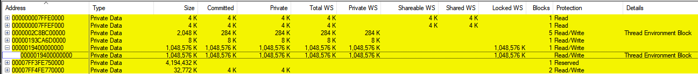

# Coding Journal, 04.11.2026, Porting Tailslayer To x86_64 Windows  

### Does ```VirtualAlloc``` Really return Physically Contiguous Memory?

I wrote a little verification function that converts a base virtual address **vaddr** to its physical counterpart **paddr**, and manually checked if 2MiB-Spaced Virtual Addresses really ARE Also 2MiB Spaced in Physical Memory, i.e  
```
for i = 0; i < 1GiB / 2MiB; ++i {
    continue_if(paddr_prev_iteration + 2MiB == paddr_curr_iteration)
}
```

Here is the verification output after using ```VirtualAlloc```

```sh
    Main thread pinned to core 14
    TSC frequency: 2.600 GHz
    GetMinimum() -> 0x400000
    GetSystemInfo() -> 0x10000, 0x1000
    v 0x1aac0400000 -> p 0x854400000 | p 0x87aa00000 + 0x200000 bytes == p 0x854400000 ? ->  NO
    Pages not contiguous (windows) (replicas): No error
    GetMinimum() -> 0x400000
    GetSystemInfo() -> 0x10000, 0x1000
    v 0x1aac0400000 ->  p0x854400000 | p 0x87aa00000 + 0x200000 bytes == p 0x854400000 ? ->  NO
    Pages not contiguous (windows) (stress): No error
```

It seems that in userspace, Windows really doesn't want you to allocate Huge 1GiB Pages   
Although, I dug around and It seems possible with **[PCILeech](https://github.com/ufrisk/pcileech)**

#### Upon Manual Verification, it seems that VirtualAlloc with MEM_LARGE_PAGES is not **NOT** Contiguous to HUGE_PAGE Granularity

<br></br>

#### VMMap and RAMMap are pretty useful

Instead of writing my manual verification function I could've just used [VMMap](https://learn.microsoft.com/en-us/sysinternals/downloads/vmmap) & [RAMMap](https://learn.microsoft.com/en-us/sysinternals/downloads/rammap):  

  


As Can be seen from the Screenshots above, ```VirtualAlloc``` only gives a contiguous **Virtual** Memory Region,  
The Underlying Memory May **NOT** Necessarily be Physically Contiguous.  
It is definitely using a Huge Page Under the Hood Sure, but Thats only half the battle...

### Misc Notes

```sh
cd build ; ninja all ; cd ../
cmake -S . -B build -G 'Ninja' -DCMAKE_EXPORT_COMPILE_COMMANDS=1
cmake -S . -B build -G 'Ninja' -DCMAKE_EXPORT_COMPILE_COMMANDS=1 -DCMAKE_BUILD_TYPE=Debug
cmake -S . -B build -G 'Ninja' -DCMAKE_EXPORT_COMPILE_COMMANDS=1 -DCMAKE_BUILD_TYPE=Release
```