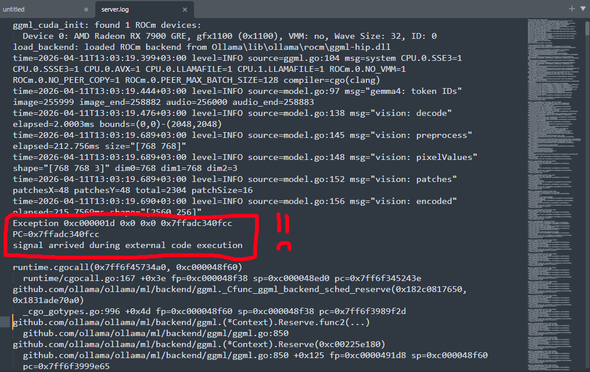

# Coding Journal, 04.12.2026, Porting Tailslayer To x86_64 Windows  

### Before Getting into the Meat of things

I'll briefly mention, that it seems there is no straightforward way to allocate Physically Contiguous Memory on windows, atleast upto a certain granularity.  
My current plan, is one of 2 options:

1. Write a kernel driver to expose [MmAllocateContiguousMemory](https://learn.microsoft.com/en-us/windows-hardware/drivers/ddi/wdm/nf-wdm-mmallocatecontiguousmemory) and its counterpart,  
  and somehow load it by using already signed kernel drivers

* Allocate a shit ton of physical pages using [AllocateUserPhysicalPages](https://learn.microsoft.com/en-us/windows/win32/api/memoryapi/nf-memoryapi-allocateuserphysicalpages), then map that memory to a virtual address using [MapUserPhysicalPages](https://learn.microsoft.com/en-us/windows/win32/api/memoryapi/nf-memoryapi-mapuserphysicalpages).  
  Then I can scan the virtual address space using [MemProcFS]() and find the biggest physically contiguous region.  
  If the memory block size satisfies the memory allocation request, Great.  
  If not, back to the drawing board >:|  
  *(Or Maybe a pc restart will do the job... lol)*

Non of them are very appetizing options, but I'll have to contend with something.  
Hey, I'm not planning to find vulnerabilities in windows anytime soon... *Yet*

### Setting Up Gemma 4 E4B For Local AI Use with Continue.dev

You may be asking yourself why I'm using AI in the first place, and you would be correct to question me  
However, it seems that for:  

* simple queries
* summarizing information
* providing resources
* general automation/boilerplate  

AI does appear to be quite useful.  

I've been using Gemini up until now, And more often than not it was pretty dumb,  
I more recently found it lacking when piecing information together,  
atleast for the fast/Thinking models available for free.
#### Also I don't like the fact that Google Uses my data all willy-nilly >:(

So, with the release of [gemma 4](https://huggingface.co/unsloth/gemma-4-E4B), I found out that I can run a local AI model!

* give it all the tools it could ever need with the help of [MCP Servers with ToolHive](https://docs.stacklok.com/toolhive/guides-ui/quickstart)
* integrate it properly to my coding environment using [continue.dev](https://www.continue.dev/continuedev/vscode)  
* Run it locally using [ollama.cpp](https://github.com/ggml-org/llama.cpp)

Ofcourse, it couldn't be that simple:

* Because I'm using an AMD Card, I had to install ROCm to leverage GPU Execution of the model
* I also found out that Release Builds (Atleast on windows) of ollamacpp compile with [AVX2](https://en.wikipedia.org/wiki/Advanced_Vector_Extensions#Advanced_Vector_Extensions_2)  
    Problem is, *my cpu Doesn't have AVX2* (See the image below)

  

Now if you develop on windows, you'll be familiar with the exception code, i.e [Illegal Instruction Exception](https://stackoverflow.com/q/44231673), meaning I had to either:

1. Build ollamacpp from scratch *(Yeah, not happening LOL)*
2. Use a different tool, that I can make sure doesn't use any illegal instructions

Eventually, I stumbled upon [Koboldcpp](https://github.com/lostruins/koboldcpp) and its [ROCM Fork](https://github.com/YellowRoseCx/koboldcpp-rocm). unfortunately, the hipBLAS runner did not work for me, so I opted to use the default Vulkan one.

All in all, it did take me a whole day to understand why can't my AI search the web, why is it stupid, [why are there so many versions of the same damn AI model](https://huggingface.co/unsloth/gemma-4-E4B-it-GGUF), what is tooling, why are MCP servers a thing, how do I use them - WHICH MARKETPLACE FOR MCP SERVERS TO USE? Just a whole mess really...

Finally, my pc did crash here and there while using 256k Context Windows *(look, that's what was advertised so I ran with it lol :| cut me some slack I have no idea what I'm doing)*, but Koboldcpp really was the saving grace here, giving me a usable interface to tinker with parameters and actually fix anything breaking.

### AI Tooling is a nightmare

I won't go into to much depth, but finding out which MCP Servers are useful, which aren't and how the hell to download them in the first place has wasted much of my time, researching frivolous websites with frivolous definitions & lists.  

In the end, [ToolHive](https://docs.stacklok.com/toolhive/guides-ui/quickstart) really saved me, since I wanted to keep every server sandboxed and not worry  
about Security or Local Setup, and it does everything I could ever want it to.  
Sure, it is a little finnicky with the Docker Containers, but flick a few levers manually and you'll be fine.

### Lastly, Continue.dev

This tool looked very intuitive and simple from the outside, but it really isn't.  
I had no idea how to integrate my AI tools to this (You have to modify a ```config.yaml``` script), and the [documentation](https://docs.continue.dev/reference) did not help at first sight -  
I needed concrete examples for specific use cases and I just did not find them.

Most importantly, there is no obvious way to debug the ```config.yaml``` file -  

* No status *(Ackshually! If you look Closely in the Bottom Right You CAN SEE A STATUS!)*  
      
* No Logging
* No Popup/Error Message
* No functional way for me to find out why I did wrong,  
  *besides pasting my code into an online llm and telling it to output yaml because apparently [continue.dev used json previously](https://docs.continue.dev/reference/json-reference)*

#### Basically, THERE IS **NO ERROR REPORTING! NO DEBUG OUTPUT! WHAT THE HELL!**  

<br></br>

### Conclusion

The AI Does (Kinda) Work. it is not perfect, but it gets the job done.  
Ofcourse, There is still a lot to learn - I hope it will be a useful future investment of my time

<br></br>

### Misc Notes

None
