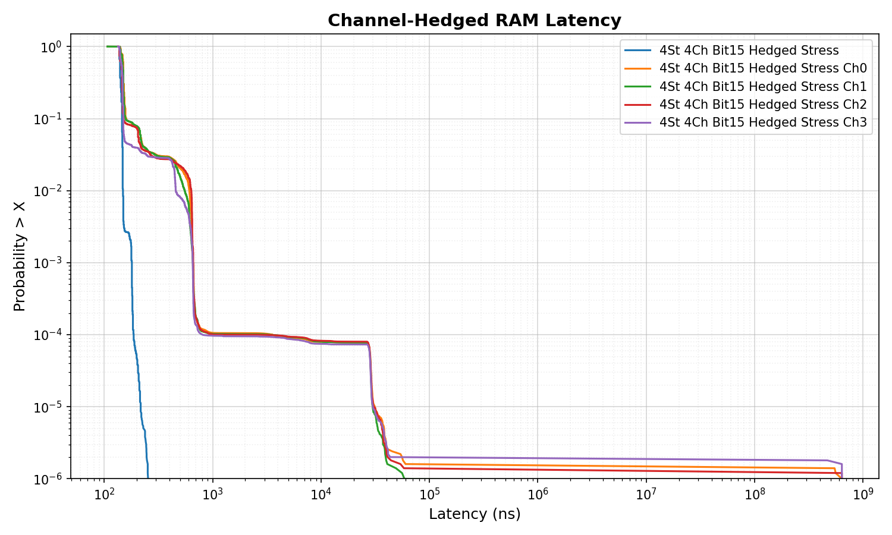
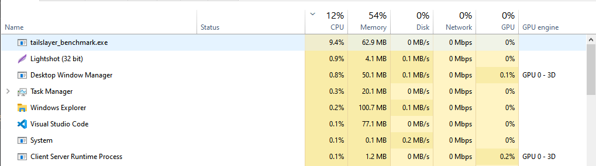
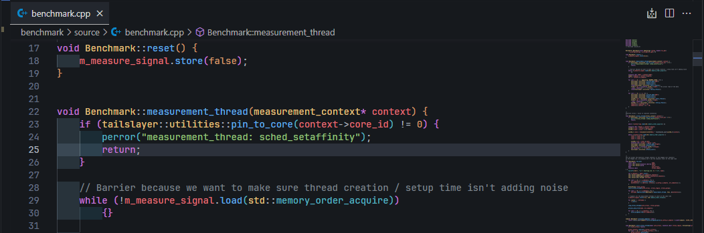
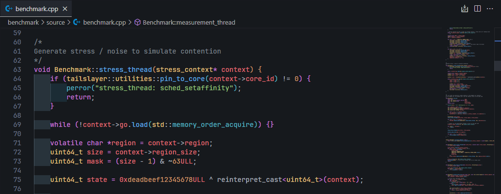
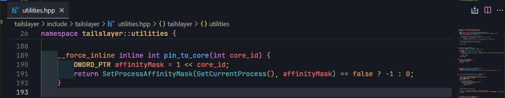
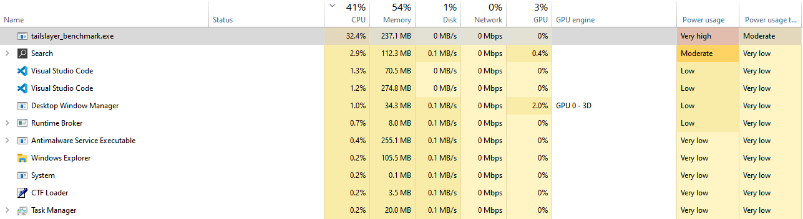

# Coding Journal, 04.21.2026, Porting Tailslayer To x86_64 Windows  

Yesterday I made a commit on the dev branch that finally fixed the issues with the win32 port.  
This is intended as one of the final writeups before finalizing this port  
Ofcourse there are still features & tests that need to be taken care of, such as:  

* Testing Correctness On Linux
* Writing a script to figure out the memory bit-offset combinations -  
  Sure, Separating memory regions by (1 << 8) Bits in physical memory works most of the time,
  but requires trial & error and is not very reliable.  
  In the case of > 4 Memory Channels there would be more bits  
  that are relevant to deciding the physical place (i.e Row-Column & banks) in the silicon.

## The Initial Issue

From my Initial investigations it seemed that the `pair_samples_n()` function did not emit ANY data to the `.csv` ouptut file, specifically for the hedged read. whether it was the `stress_arm` or `quiet_arm` didn't change the result either.  
Here is a log that I kept from that benchmark run:

```text
=== ARM: hedged_quiet_ch3 (n=5000000) ===
  min=147 (56.5ns)  p50=166 (63.8ns)  p90=196 (75.4ns)  p95=243 (93.5ns)
  p99=544 (209.2ns)  p99.9=679 (261.2ns)  p99.99=4658 (1791.5ns)  max=256726830 (98741618.3ns)
  mean=672.2 (258.6ns)
  Dumped 5000000 raw latencies to dual_quiet_bit8_hedged_quiet_ch3.csv
  Pairing: 0/5000000 samples paired across 4 channels (0.0%)

=== ARM: hedged_quiet (n=0) ===
  min=0 (0.0ns)  p50=0 (0.0ns)  p90=0 (0.0ns)  p95=0 (0.0ns)
  p99=0 (0.0ns)  p99.9=0 (0.0ns)  p99.99=0 (0.0ns)  max=0 (0.0ns)
  mean=0.0 (0.0ns)
  Dumped 0 raw latencies to dual_quiet_bit8_hedged_quiet.csv
```

<details>

You can also see the [output_incorrect_pin_core.log](output_incorrect_pin_core.log) file here

<summary>click here to see the full stdout.txt</summary>

```text
arm,n_samples,n_paired,tsc_ghz,min_cyc,p50_cyc,p90_cyc,p95_cyc,p99_cyc,p999_cyc,p9999_cyc,max_cyc,mean_cyc
hedged_quiet_ch0,5000000,5000000,2.600,119,160,175,235,601,678,3830,262567440,464.5
hedged_quiet_ch1,5000000,5000000,2.600,154,166,223,246,553,682,4178,262361131,575.5
hedged_quiet_ch2,5000000,5000000,2.600,107,160,177,235,602,678,4147,264065573,686.2
hedged_quiet_ch3,5000000,5000000,2.600,147,166,196,243,544,679,4658,256726830,672.2
hedged_quiet,5000000,0,2.600,0,0,0,0,0,0,0,0,0.0
  hedged_quiet_ch0 stride: min=292 p50=309 p99=740 max=936 (first 10000 samples)

=== ARM: hedged_quiet_ch0 (n=5000000) ===
  min=119 (45.8ns)  p50=160 (61.5ns)  p90=175 (67.3ns)  p95=235 (90.4ns)
  p99=601 (231.2ns)  p99.9=678 (260.8ns)  p99.99=3830 (1473.1ns)  max=262567440 (100988018.8ns)
  mean=464.5 (178.7ns)
  Dumped 5000000 raw latencies to dual_quiet_bit8_hedged_quiet_ch0.csv
  hedged_quiet_ch1 stride: min=306 p50=321 p99=741 max=28156 (first 10000 samples)

=== ARM: hedged_quiet_ch1 (n=5000000) ===
  min=154 (59.2ns)  p50=166 (63.8ns)  p90=223 (85.8ns)  p95=246 (94.6ns)
  p99=553 (212.7ns)  p99.9=682 (262.3ns)  p99.99=4178 (1606.9ns)  max=262361131 (100908668.8ns)
  mean=575.5 (221.3ns)
  Dumped 5000000 raw latencies to dual_quiet_bit8_hedged_quiet_ch1.csv
  hedged_quiet_ch2 stride: min=281 p50=293 p99=667 max=866 (first 10000 samples)

=== ARM: hedged_quiet_ch2 (n=5000000) ===
  min=107 (41.2ns)  p50=160 (61.5ns)  p90=177 (68.1ns)  p95=235 (90.4ns)
  p99=602 (231.5ns)  p99.9=678 (260.8ns)  p99.99=4147 (1595.0ns)  max=264065573 (101564226.9ns)
  mean=686.2 (263.9ns)
  Dumped 5000000 raw latencies to dual_quiet_bit8_hedged_quiet_ch2.csv
  hedged_quiet_ch3 stride: min=294 p50=312 p99=706 max=846 (first 10000 samples)

=== ARM: hedged_quiet_ch3 (n=5000000) ===
  min=147 (56.5ns)  p50=166 (63.8ns)  p90=196 (75.4ns)  p95=243 (93.5ns)
  p99=544 (209.2ns)  p99.9=679 (261.2ns)  p99.99=4658 (1791.5ns)  max=256726830 (98741618.3ns)
  mean=672.2 (258.6ns)
  Dumped 5000000 raw latencies to dual_quiet_bit8_hedged_quiet_ch3.csv
  Pairing: 0/5000000 samples paired across 4 channels (0.0%)

=== ARM: hedged_quiet (n=0) ===
  min=0 (0.0ns)  p50=0 (0.0ns)  p90=0 (0.0ns)  p95=0 (0.0ns)
  p99=0 (0.0ns)  p99.9=0 (0.0ns)  p99.99=0 (0.0ns)  max=0 (0.0ns)
  mean=0.0 (0.0ns)
  Dumped 0 raw latencies to dual_quiet_bit8_hedged_quiet.csv

```

</details>

one can see by just a glance, that the benchmark did not match any statistically significant data. Moreso than that, the maximum case `max=256726830` was unusually high (almost an entire second!)

### Digging Deeper

Since I was at a loss here and didn't know where to look, I decided print some debug statements (i.e printf :>), and eventually modified the `pair_samples_n()` function to output *some* sort of data. That way, I could check whether the hedging strategy even works:  

inside [benchmark.cpp](./../../benchmark/source/benchmark.cpp:370):  
```cpp
        ...
        ...
        // All timestamps within the acceptable gap?
        // printf("  %llx\n", (max_ts - min_ts));
        // util2_debug({
        //     std::cout << "DEBUG: Max: " << max_ts << " Min: " << min_ts << " Diff: " << (max_ts - min_ts) << "\n";
        // })
        if ((max_ts - min_ts) < AppConfig::MAX_PAIR_GAP) {
            out_effective.push_back(min_latency);
            for (int c = 0; c < n_channels; ++c) {
                indices[c]++; // Move the window forward for all channels
            }
        } else {
            // They are spread too far apart. Advance the channel that is lagging furthest behind in time.
            indices[min_idx_channel]++;
        }
```

And the new pair sample function inside [benchmark.cpp](./../../benchmark/source/benchmark.cpp:390):  
```cpp
int Benchmark::pair_samples_n2(
    const std::vector<sample*>& all_samples, 
    int                         num_samples, 
    std::vector<uint64_t>&      out_effective
) const {
    int n_channels = all_samples.size();
    if (n_channels == 0) {
        return 0;
    }


    std::vector<int> indices(n_channels, 0);
    uint64_t minLatency = UINT64_MAX, maxLatency;
    for(int i = 0; i < num_samples; ++i) {
        minLatency = UINT64_MAX;
        for (int c = 0; c < n_channels; ++c) 
        {
            minLatency = all_samples[c][i].latency < minLatency ? all_samples[c][i].latency : minLatency;
            maxLatency = all_samples[c][i].latency > maxLatency ? all_samples[c][i].latency : maxLatency;
        }

        out_effective.push_back(minLatency);
    }

    return out_effective.size();
}
```

<br></br>

On the surface, it seemed that these changes did show that the hedging strategy worked:  
[Benchmark for 4 DRAM Channels, 4 Stress Threads, with bit 15 as the offset](old_benchmark_hedging_with_min_sampling.png)
  

But, for some reason, CPU utilization was very very low, compared to running on Quad-Channel Memory, with 4 stress threads enabled in the benchmark (~9 concurrent Threads):  
[9% CPU Usage Would be 1.5 Cores on my machine :)](old_benchmark_cpu_usage_stuck.png)
  


### The Eureka

After a couple of days I came to a surprising ( *at the time, obviously :)* ) realization:  
*Wait. If CPU Utilization is low, then I must be scheduling/assigning cpu affinities in a wrong way!*  

Initially, I looked at the scheduling code and it seemed to make logical sense(?):  
Moreover, If there were issues with CPU scheduling, it might be that theres' a problem with `pin_to_core(...)`  


[Measurement thread entry](old_measurement_thread.png):  
  

[Stress thread entry](old_measurement_thread.png):  
  

[pin_to_core function](old_pin_to_core.png):  
  

<br></br>

You may have already found out what the issue was if you're familiar with windows internals,  
but at the time, it literally took me days to realize I was using the *wrong function!*  

[SetProcessAffinityMask](https://learn.microsoft.com/en-us/windows/win32/api/winbase/nf-winbase-setprocessaffinitymask) sets a bitmask that applies to the whole process - this bitmask dictates which processors are allowed to "run" on the current process  
i.e, if `pin_to_core` was *"pinning"* to core 5, then core 5 would be used to multithread the whole benchmark, running with 4-8 threads!  
Even worse than that, Imagine that each separate thread is calling `pin_to_core`, which means that the benchmark executable-process is shuffling thread affinities on every entry to a benchmark-thread  

Now, the initial solution is to use [setThreadAffinityMask](https://learn.microsoft.com/en-us/windows/win32/api/winbase/nf-winbase-setthreadaffinitymask) instead, but that is not the whole story.  
Up until Windows 7/10, this solution would indeed work as a fallback method.  
But, Starting from Windows 10, Windows added the concept of `Thread Groups` - a bunch of at most 64 Processing Cores/Hyperthreading Cores.  
In practice, this means that a multi-processor machine (i.e 2 Xeon Processors) That has more than 64 Cores will split the CPU's into 2 groups - a group with 64 cores, and the rest.  

Now by default, every process will be run on an initial `Primary Group` that was assigned to it.  
but, it still has access to other thread groups - it just needs to schedule its threads accordingly with the [setThreadGroupAffinity](https://learn.microsoft.com/en-us/windows/win32/api/processtopologyapi/nf-processtopologyapi-setthreadgroupaffinity) function.  

By the way, the terminology of a `Primary Group` is technically only valid starting from Windows 11;  
there are also further caveats, such as the new `CpuSets` API that was introduced.  
I really only scratched the surface with this explanation, and it really doesn't do this topic any justice.  
So, I'll just refer you to some links so that you can read it yourself :D  
For more information regarding this mess, see:  

* [Processor Groups](https://learn.microsoft.com/en-us/windows/win32/procthread/processor-groups)  
* [CPU Sets](https://learn.microsoft.com/en-us/windows/win32/procthread/cpu-sets)
* [SetThreadSelectedCpuSetMasks](https://learn.microsoft.com/en-us/windows/win32/api/processthreadsapi/nf-processthreadsapi-setthreadselectedcpusetmasks)
* [Also see this amazing Stackoverflow answer regarding the many & plenty of caveats](https://stackoverflow.com/a/76322720)


[Finally though, it seems that did the trick](tailslayer_stress_working_4threads.png):  
 

### Misc Notes

Compiling and building:  

```powershell
cmake -S . -B build -G Ninja -DCMAKE_EXPORT_COMPILE_COMMANDS=1 -DCMAKE_C_COMPILER=clang -DCMAKE_CXX_COMPILER=clang++ -DCMAKE_BUILD_TYPE=Release -DCMAKE_C_FLAGS="-O3 -march=native" -DCMAKE_CXX_FLAGS="-O3 -march=native"
```

```powershell
cd build ; ninja all -j8 ; cd ../
```

Running the old benchmark as administrator:

```powershell
Start-Process cmd.exe -Verb RunAs -ArgumentList "/c cd /d ""$PWD\build\bin"" && start """" /realtime /b tailslayer_benchmark.exe --arm dual_stress --samples 5000000 --stress-threads 4 --channels 2 --channel-bit 10 --raw-prefix 4st_2ch_bit10 > output.log 2>&1"

```

Running the (now old) benchmark script:

```powershell
cd benchmark/scripts
python plot_latencies.py
```
